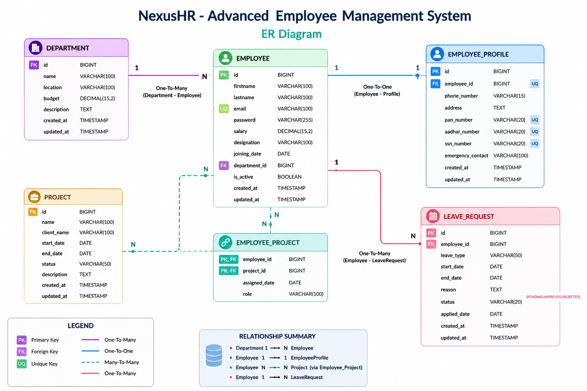
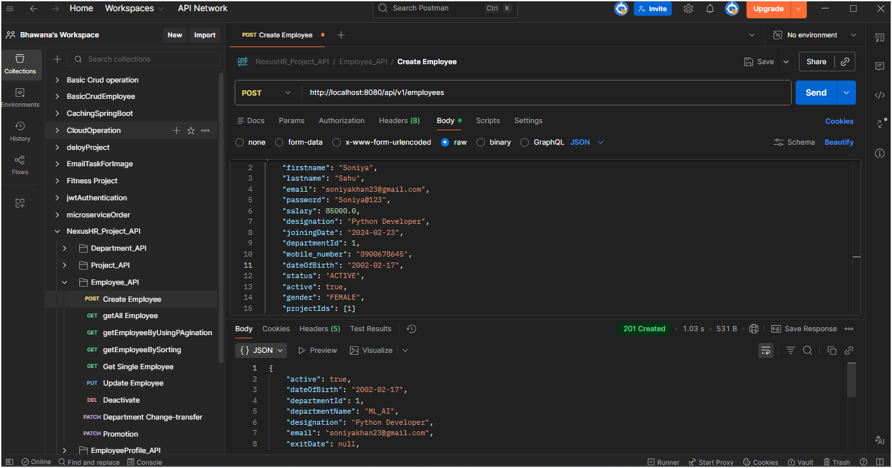
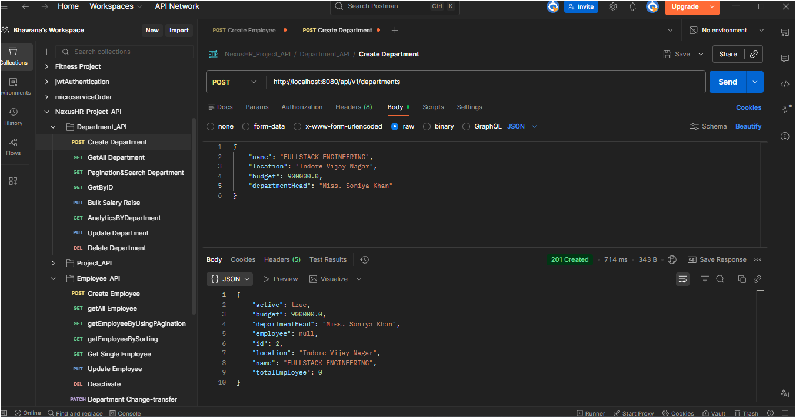
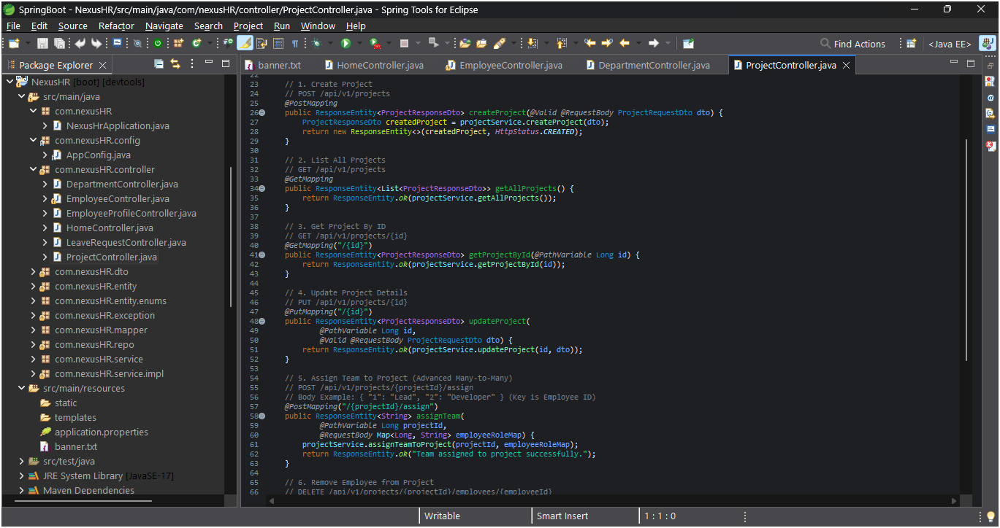
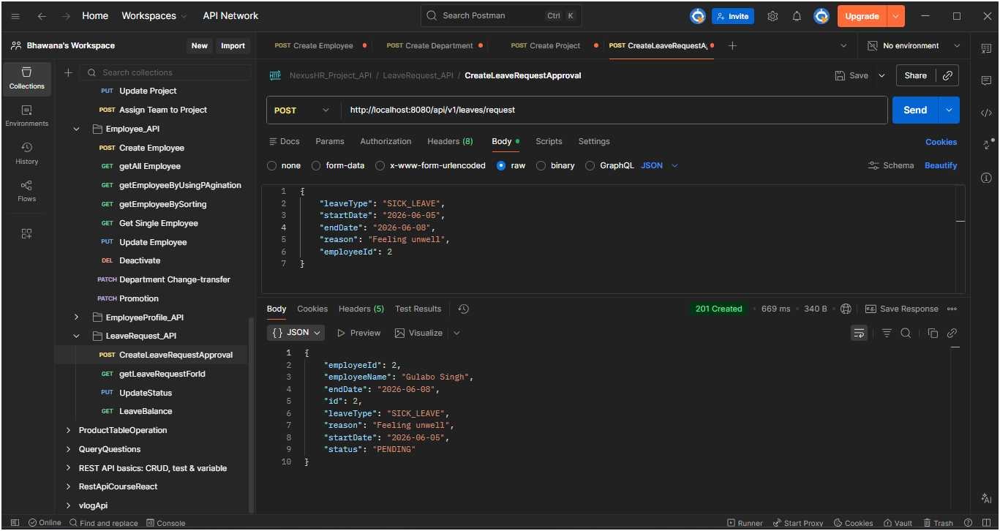

# 🚀 NexusHR - Advance Employee Management System

### Enterprise Level HR Management Backend using Spring Boot

 

---

# 🛠 Technologies Used

---

# 📌 Project Overview

NexusHR is an advanced Employee Management System developed using Spring Boot and MySQL.

This system provides a complete HR management solution for organizations.

### Key Modules

 Employee Management

 Department Management

 Project Management

 Employee Profiles

 Leave Management

 Analytics & Reporting

 Soft Delete Implementation

 Pagination & Sorting

 Validation Handling

 Global Exception Handling

---

# 👩‍💻 Author

### Bhawana Ahirwar

Backend Java Developer

---

# 🔗 Project Links

## GitHub Repository

https://github.com/Bhawana-A/NexusHR-Advance-Employee-Management-System

## Swagger API Documentation

https://nexushr-advance-employee-management-1u4v.onrender.com/swagger-ui/index.html

## Live Deployment

https://nexushr-advance-employee-management-1u4v.onrender.com

---

# 🏗️ System Architecture

## Entity Relationships

* Department → Employees
* Employee → Profile
* Employee → Leave Requests
* Employee ↔ Projects (Many-To-Many)

---

# 📂 Database ER Diagram

---

# 📸 Project Screenshots

## Swagger Dashboard

---

## Employee APIs

---

## Department APIs

---

## Project APIs

---

## Leave APIs

---

# 🚀 API Endpoints

## Employee APIs

| Method | Endpoint                        |
| ------ | ------------------------------- |
| POST   | /api/v1/employees               |
| GET    | /api/v1/employees               |
| GET    | /api/v1/employees/{id}          |
| PUT    | /api/v1/employees/{id}          |
| DELETE | /api/v1/employees/{id}          |
| PATCH  | /api/v1/employees/{id}/transfer |
| PATCH  | /api/v1/employees/{id}/promote  |

---

## Department APIs

| Method | Endpoint                       |
| ------ | ------------------------------ |
| POST   | /api/v1/departments            |
| GET    | /api/v1/departments            |
| GET    | /api/v1/departments/{id}       |
| PUT    | /api/v1/departments/{id}       |
| DELETE | /api/v1/departments/{id}       |
| PUT    | /api/v1/departments/{id}/raise |
| GET    | /api/v1/departments/{id}/stats |

---

## Employee Profile APIs

| Method | Endpoint                                |
| ------ | --------------------------------------- |
| POST   | /api/v1/employee-profiles               |
| GET    | /api/v1/employee-profiles/employee/{id} |
| PUT    | /api/v1/employee-profiles/employee/{id} |
| DELETE | /api/v1/employee-profiles/employee/{id} |

---

## Leave APIs

| Method | Endpoint                                     |
| ------ | -------------------------------------------- |
| POST   | /api/v1/leaves/request                       |
| PUT    | /api/v1/leaves/{id}/status                   |
| GET    | /api/v1/leaves/employee/{employeeId}         |
| GET    | /api/v1/leaves/employee/{employeeId}/balance |

---

## Project APIs

| Method | Endpoint                                            |
| ------ | --------------------------------------------------- |
| POST   | /api/v1/projects                                    |
| GET    | /api/v1/projects                                    |
| GET    | /api/v1/projects/{id}                               |
| PUT    | /api/v1/projects/{id}                               |
| PATCH  | /api/v1/projects/{id}/status                        |
| POST   | /api/v1/projects/{projectId}/assign                 |
| DELETE | /api/v1/projects/{projectId}/employees/{employeeId} |

---

# ✨ Features

### Employee Management

* Employee Onboarding
* Employee Promotion
* Employee Transfer
* Soft Delete

### Department Management

* Department Creation
* Budget Management
* Salary Raise
* Department Analytics

### Leave Management

* Leave Requests
* Leave Approval
* Leave History
* Leave Balance Calculation

### Project Management

* Project Creation
* Team Assignment
* Project Timeline
* Status Tracking

---

# 📁 Project Structure

src

├── controller

├── dto

├── entity

├── enums

├── exception

├── mapper

├── repository

├── service

├── serviceImpl

└── config

---

# 📈 Future Enhancements

* JWT Authentication
* Spring Security
* Role Based Access Control
* Attendance Module
* Payroll System
* Email Notifications
* Dashboard Analytics

---

# ⭐ Support

If you like this project, don't forget to give it a Star ⭐ on GitHub.

---

### 🚀 © 2026 Bhawana Ahirwar | NexusHR Employee Management System

